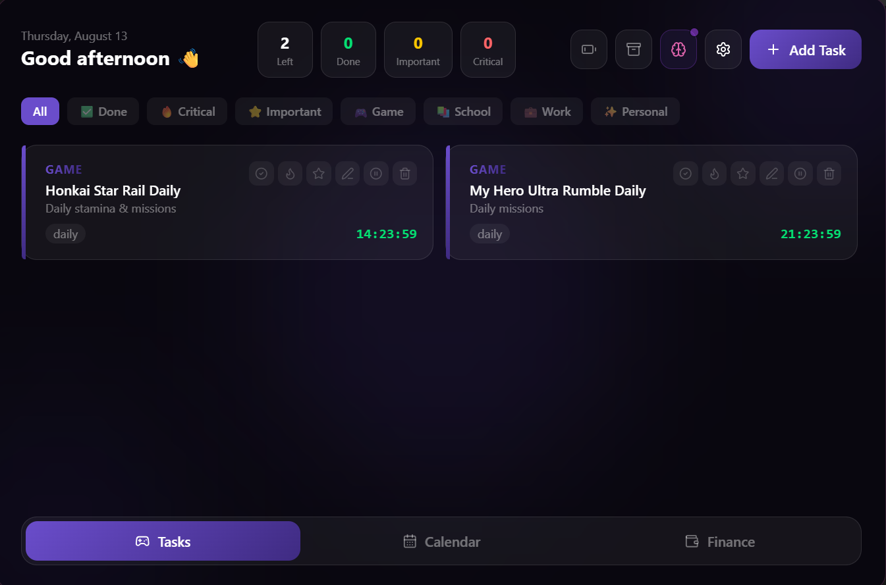
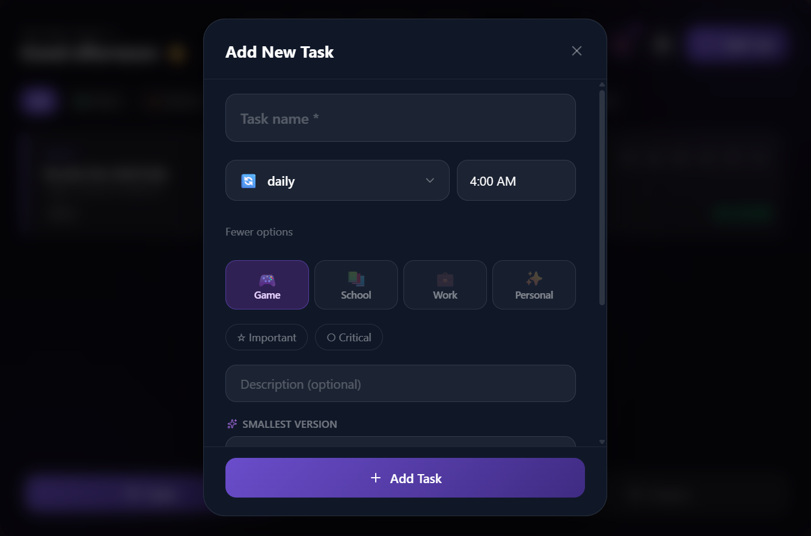
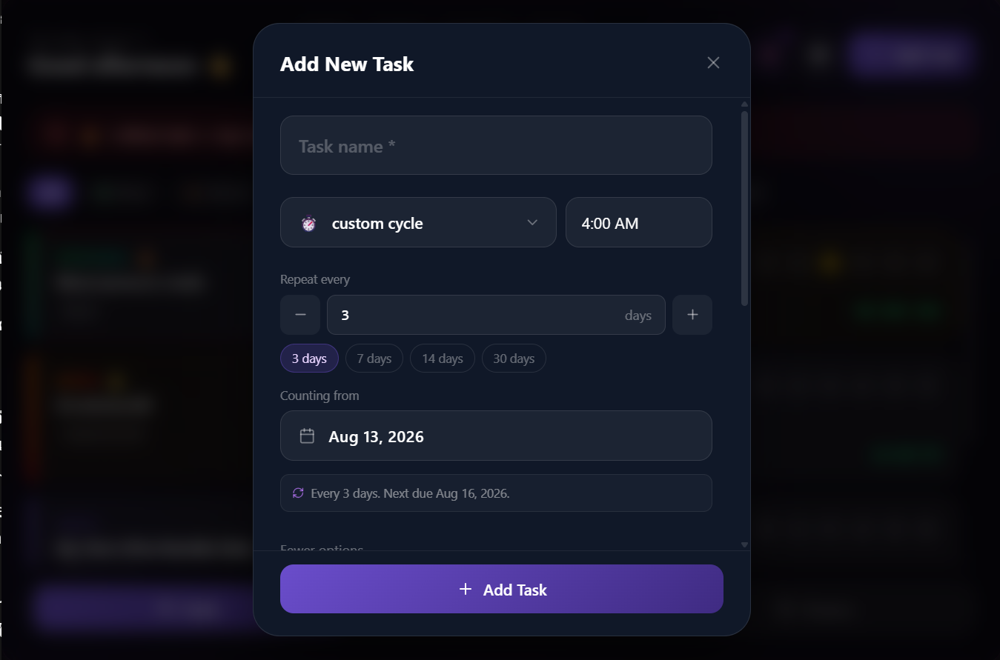
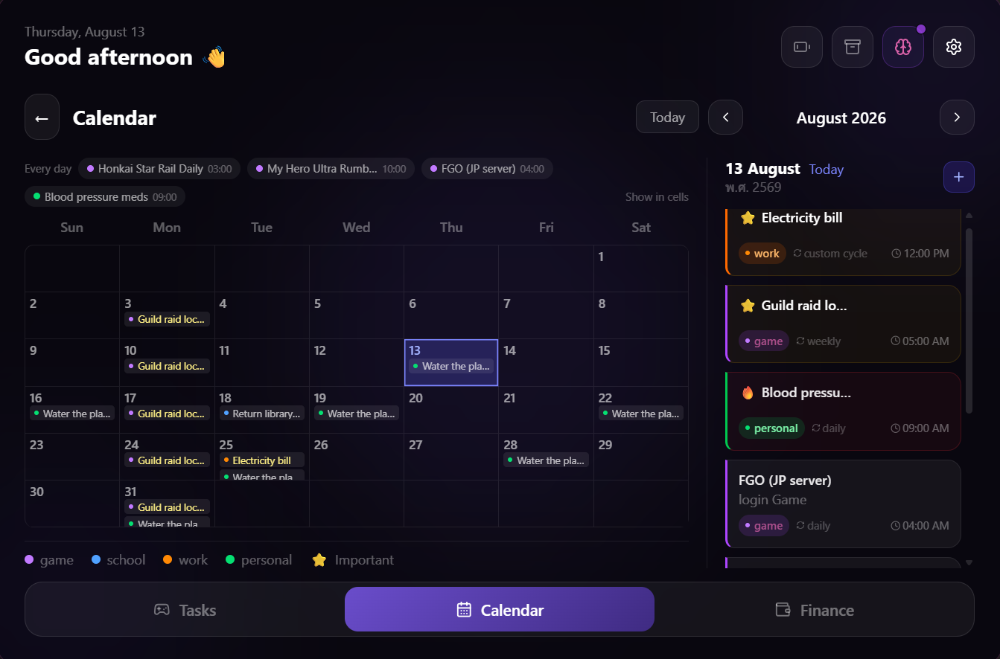
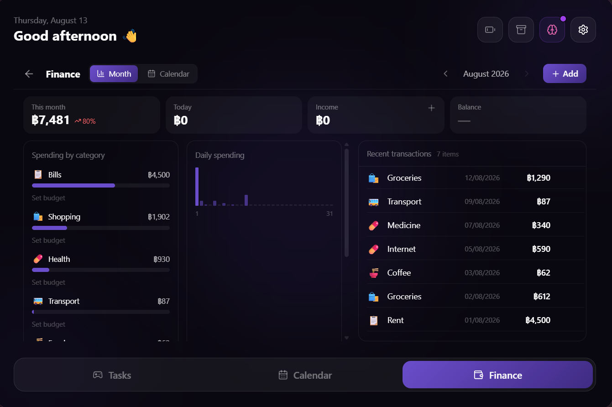

# game-scheduler

A desktop app that answers one question: what resets soon?

Games reset dailies at 04:00, weeklies on Monday, events on a fixed date, and
some of them do it on a server in a different country. Add the non-game things
that work the same way — rent, a subscription, a bill — and keeping track in
your head stops working. So this keeps track instead.

Built with Tauri 2, React 19 and TypeScript. Windows only so far, because that
is what I have.

I wrote it for myself and still use it every day. It is public because most of
the interesting parts are the decisions rather than the code, and those are
worth reading even if nobody else ever installs it.

---

## What it does

Six kinds of reset: daily, weekly, every fortnight, every N days from an anchor
date, a one-off date, and an event window with an end. Each task can be pinned
to its own timezone or float with the app's, which is the difference between a
Japanese server that resets at 04:00 Tokyo no matter where you are and a
reminder that should follow you when you travel.







Countdowns tick live. Pause a task and it goes quiet without being deleted.
Delete one and it sits in the trash for thirty days.

There is a money side too — log spending in one line of plain Thai, or point it
at a screenshot of a bank transfer slip and let it read the amount. The image
never gets stored.



Notifications respect quiet hours. Themes can be generated from an image.
There is a live wallpaper feature that mostly works, about which see below.


---

## Running it

```
pnpm install
pnpm tauri dev
```

Building needs the Rust toolchain and the usual Tauri prerequisites.

```
pnpm build        # typecheck + vite build
pnpm tauri build  # installer
pnpm eval         # the parser regression suite, see below
```

Bump the version with `pnpm bump` rather than by hand. It writes both
`package.json` and `tauri.conf.json`, and if those two disagree the installer
decides there is nothing to upgrade and silently does nothing. Ask me how I
know.

AI features are optional. Without a key everything still works; the command
parser runs entirely on the device and handles most of what I actually type.

---

## Decisions worth explaining

Most of these cost me something to arrive at, so they are written down in the
source next to the code they explain. The short version:

**No streaks, no completion percentage, no charts.** A streak turns a bad day
into a loss of something you built, which works on people who are already doing
fine and does the opposite to everyone else. The app knows a task is overdue; it
does not know why, and guessing in a way that reads as judgement is worse than
saying nothing. "This cycle has closed" is a fact. "You missed 3 days" is a
verdict with a number attached to make it look like measurement.

**Silence is the default.** A reminder app that makes noise gets its
notifications switched off wholesale within a week, and after that it notifies
about nothing forever while looking exactly the same as one that works.

**"Nothing resets today" is an answer, not an invitation.** The empty state does
not end with a button suggesting you add more.

**The AI never sees anything heavy.** There is a two-tier matcher that
distinguishes Thai figures of speech — `เหนื่อยอยากตาย` is an intensifier, so is
`อร่อยอยากตาย` — from the same words used plainly. Matches are handled on the
device and never sent anywhere. The obvious better approach is to let a model
judge the context, which is exactly what cannot be done, because doing it means
sending the sentence off the machine. Privacy over accuracy, deliberately.


**There is a card for information you might want in a hurry.** It is local-only,
excluded from backups, and never synced. It is called "สิ่งสำคัญ" rather than
anything more specific, because a neutral name is one that can sit on a screen
without announcing itself.

**Sync metadata exists before sync does.** Every table already has a UID, an
`updated_at` maintained by a database trigger, and tombstones for deletes. None
of it is used yet. Retrofitting it onto tables with real data in them is the
part that hurts, and doing it while the tables held forty rows cost an
afternoon.

---

## Rough edges

**The live wallpaper is not finished.** It renders video behind the desktop
icons and it does work, but changing the video freezes the UI until you alt-tab,
and toggling it off can crash the process. The interesting part is why: parenting
a window to `WorkerW` ties your input queue to `explorer.exe`, and after that
either side stalling takes the other with it. Every library I tried does the
same `SetParent` call and hits the same wall. The current fix runs the wallpaper
as a separate process — the same executable with a `--wallpaper` flag — so
explorer can only freeze the child. That solved most of it. Not all of it.

**Roughly 53 places still say "Gemini"** when they mean whichever AI provider is
configured. Cosmetic, tedious, unfixed.

**Windows only.** Nothing in the code is deliberately Windows-specific except
the wallpaper, but nothing has been tested anywhere else either.

https://github.com/user-attachments/assets/8aa75211-7716-4e84-ab07-39d5a2d5a89f


---

## Tests

`pnpm eval` runs the command parser against a corpus of sentences and reports
one number that matters: how many it answered confidently and wrongly. That
count must be zero. A parser that hands a sentence off to the model when it is
unsure is fine. A parser that is certain and wrong never appears in a log,
never throws, and quietly does the wrong thing.

The corpus is deliberately stacked with hard cases, so the on-device hit rate it
reports is much lower than the real one.

---

## Not a medical device

Some of the design above is about wellbeing. That does not make this a health
app. It does not assess, screen, diagnose or treat anything, and it is not a
substitute for care from an actual person.

---

## Licence

MIT.
